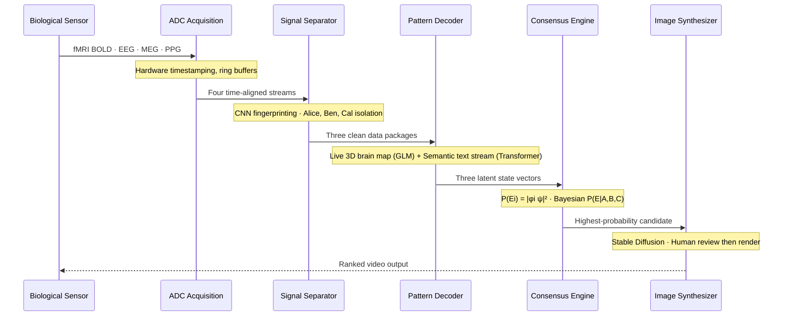

# Neurosect — A Speculative Multimodal Medical Imaging System

**Inspired by Minority Report's Precognitive Computer**  
*A Systems Architecture and Signal Processing Case Study*

> **Authors:** Amelia Arabe · Irene Ronda Gómez · Alan Aquino  
> **Course:** ECE 187 Biomedical Imaging and Sensing  
> **Institution:** Electrical and Computer Engineering Department, UC San Diego  

---

## Abstract

The technology depicted in the early-2000s science fiction film *Minority Report* can be engineered using contemporary classical imaging techniques. fMRI, EEG, PPG, and MEG work in unison to create two clear reconstructions of brain activity: a delayed stream of all neuron movement on a 3D brain map and video feedback of the subject's thoughts. Multimodal data are fed into three specialised AI decoding networks, which analyse brain activity and compute probabilities. This paper examines the plausibility of the technology through a lens that stays true to the film — three genetically engineered individuals tasked with predicting the future.

---

## The Engineering Challenge: High-Bandwidth Signal Fusion

Neurosect is not primarily a neuroscience project. It is a **signal fusion problem** — one of the most demanding classes of real-time systems engineering.

### The Temporal Mismatch Problem

| Modality | Temporal Resolution | Spatial Resolution | Raw Throughput |
|---|---|---|---|
| EEG | ~1ms · 1 kHz sampling | Low (scalp-surface) | 6.1 MB/s |
| MEG | ~1ms · SQUID sensors | Medium (source-localised) | 9.8 MB/s |
| PPG | ~8ms · 125 Hz | Systemic (cardiovascular) | <1 KB/s |
| fMRI | 1–2 seconds (BOLD) | High (~1–2 mm³) | 200–400 MB/s |

**Total sustained throughput: ~210–420 MB/s**

EEG and MEG operate at the millisecond scale. fMRI operates at the second scale. A three-order-of-magnitude difference in temporal resolution. Any fusion system that does not account for this at the data acquisition layer will produce corrupted cross-modal correlations regardless of decoder quality downstream.

---

## The Three Subjects: Alice, Ben, and Cal

Neurosect's three precogs are developed from donor gametes via in vitro fertilisation and raised in sealed ectogenesis chambers with continuous neural modification. Their neurons are genetically engineered to respond to transcranial focused ultrasound (tFUS) — driving synchronised theta-like states that enable detection of unresolved probability patterns before they collapse into a single final outcome.

### Subject Roles

**Alice — Primary Hypothesis Channel**  
Produces visions in probabilistic order. Her stream provides the primary semantic narrative and ordered ranking of candidate futures. Alice's larger hippocampal volume gives her fMRI stream the most reliable spatial anchor for Signal Separator isolation. Her neural state vector serves as the primary reference for the quantum probability calculator.

**Ben — Independent Confirmatory Channel**  
Functions as an independent probabilistic corroborator. His decoded output runs alongside Alice's stream and is held in reserve for the Consensus Engine. When his stream converges with Alice's, P(E|A,B,C) climbs. When he diverges, the system flags a minority report.

**Cal — Independent Confirmatory Channel**  
A second independent confirmatory stream. Cal's randomised output, cross-referenced against Alice and Ben, determines the final consensus ranking. PPG arousal monitoring for each precog acts as an independent cross-check — unusual cardiac changes flag neural frames for exclusion.

### The Minority Report Flag

When Ben or Cal diverges from Alice entirely, the system flags a **minority report** — a low-probability alternative future preserved in the output, ranked separately from the consensus outcome. The Consensus Engine produces a probability distribution. Intervention remains a human decision.

---

## System Architecture: The Precog Habitat

### Bio-Support Tank

Three precogs are housed in a shared bio-support tank containing a nutrient and oxygen-delivering suspension fluid that keeps them alive and physically stable during long recording periods. Movement is limited to reduce imaging artifacts.

### Sealed Neuro-Interface Helmet

Each precog's head is enclosed in a sealed neuro-interface helmet containing a coupling fluid engineered to be:

- **Degassed** — no bubble artifacts
- **Proton-poor** — contributes no competing MRI signal
- **Electrically insulating** — does not interfere with EEG signal
- **Acoustically matched** — optimises tFUS propagation and precision

A ring of small tFUS transducers surrounds each head inside the helmet, delivering focused ultrasound waves through the coupling fluid to the skull — activating the engineered neurons and pushing each brain into the synchronised state required for predictive cognition.

### Signal Routing

EEG and PPG sensor cables pass through a sealed opening in the helmet, then through another sealed opening in the tank, and connect to external decoding computers. The floor cables in the operational environment — colour-coded pink (Alice), blue (Ben), teal (Cal) — represent this multimodal signal routing.

---

## Multimodal Imaging Platform

### fMRI — Spatial Foundation

fMRI maps neuron activation via the BOLD (Blood Oxygen Level Dependent) haemodynamic response — measurable changes in MRI signal intensity at sites of neural activation. Spatial resolution: ~1–2 mm³. Each helmet contains its own head-specific receiver coil. A single high-field magnet images all three precogs simultaneously while the proton-poor coupling fluid contributes no competing MRI signal.

### EEG — Temporal Resolution

Captures electrical summation of neuron firing at millisecond resolution. Skull distortion limits spatial precision, but EEG captures neural events as they unfold — before the BOLD response has even begun.

### MEG — Temporal + Spatial

Reads magnetic fields produced by neural activation currents using SQUID sensors. Magnetic fields pass through the skull without distortion, giving MEG superior spatial resolution compared to EEG while maintaining the same millisecond temporal precision. NeuroSect uses EEG and MEG together because they capture the same neural event from different physical angles.

### PPG — Physiological Confirmation

Measures heart rate, heart rate variability, and pulse waveform morphology — reflecting autonomic state, cognitive load, and emotional arousal. Unusual cardiac changes flag neural frames for the AI pipeline to discard. PPG also removes heartbeat noise from the fMRI BOLD signal by modelling the cardiac artifact.

---

## AI Decoding Pipeline: Five Stages

### Stage 0 — Subject-Specific Calibration

The system is trained continuously on each precog from birth. By operational maturity, individual decoders map neural signatures with precision that far exceeds what any single training session could achieve. Current semantic decoders require approximately 16 hours of individual training data (Tang et al., 2023). A near-future protocol using spoken word decoding and passive resting state fingerprinting could compress this to under 15 minutes.

### Stage 1 — Signal Separator

Three brains, four modalities, one shared scanner. The Signal Separator identifies, sorts, and delivers every stream before any decoding begins. The fMRI BOLD signal builds a continuous 3D map of the shared imaging environment, establishing each brain's precise anatomical location. A CNN pre-trained on each subject's calibration data assigns voxel-level BOLD activity to the correct precog with increasing accuracy. Alice's larger hippocampal volume provides the most reliable spatial anchor.

**Output:** Three separate, fully organised, time-aligned data packages — one for each precog.

### Stage 2 — 3D Pattern Decoder

Two simultaneous outputs per precog:

1. **Live 3D brain map** — built from fMRI BOLD signal using the General Linear Model of fMRI analysis, solving the haemodynamic response model continuously across all voxels
2. **Continuous semantic text stream** — a transformer-based language model trained on each precog's brain during calibration maps neural activation patterns to natural language (same architecture as UT Austin semantic decoder, Tang et al., Nature Neuroscience 2023)

Alice's text stream is the primary ordered narrative. Ben's and Cal's streams are parallel probabilistic corroborators held in reserve for the Consensus Engine.

### Stage 3 — Image Synthesizer

Built on **Stable Diffusion** — a latent diffusion model that generates high-resolution images from decoded neural representations. Takagi and Nishimoto (2023) demonstrated that fMRI BOLD contains sufficient information to condition a Stable Diffusion model into reconstructing accurate visual scenes, decoding semantic content, spatial layout, and depth simultaneously.

Alice is the primary source. Spatial features corroborated across all three streams are rendered at full probability weight. Alice-only features are flagged as unconfirmed. Scientists review the ranked text feed before any video is generated — human-in-the-loop decision making is built in by design.

### Stage 4 — Consensus Engine

Every candidate future passes through here before a frame of video is rendered. Three layers:

1. **Neural feature extraction** — decoded outputs translated into comparable data structures
2. **Quantum probability calculator** — maintains a library of all candidate futures, assigning probability amplitudes using Alice's neural state vector as primary reference
3. **Bayesian Consensus Engine** — cross-references amplitudes against agreement across all three streams

```
P(E | A, B, C) = P(A|E) · P(B|E) · P(C|E) · P(E) / P(A, B, C)

P(Eᵢ) = |⟨φᵢ|ψ⟩|²

Where:
|ψ⟩ = composite neural state vector from all three decoded streams
|φᵢ⟩ = learned basis vector for the i-th candidate event category
```

**Output:** The highest-probability candidate sent to the Image Synthesizer. Scientists receive a ranked text feed of the top fifteen alternative futures — similar outcomes with small detail differences, and futures that diverge entirely — preserving full probability landscape visibility.

---

## Signal Flow Diagram



---

## The Embedded Systems Perspective

### Why This Translates to Real Engineering

**Sensor Fusion:** Whether fusing EEG and fMRI or LiDAR and radar, time-aligning asynchronous data streams at different sampling rates is the same class of problem. Neurosect required designing a synchronisation arbiter, buffer management strategy, and cross-modal alignment protocol — all directly transferable to automotive or medical device sensor fusion.

**Signal Integrity:** Extracting meaningful signal from microvolt-level neural data in a hospital EMI environment is a harder signal integrity problem than most embedded systems encounter. The filtering, shielding, and artifact rejection strategies apply to any high-sensitivity sensor system.

**Real-Time Constraints:** The latency requirements for real-time neural decoding — processing a full EEG window and outputting a latent vector within one sampling period — are more demanding than most embedded systems targets.

### Computational Requirements

| Layer | Component | Function |
|---|---|---|
| FPGA Preprocessing | Xilinx UltraScale+ | Noise filtering, ADC interfacing, HW timestamping, buffer management |
| Clock Sync | IEEE 1588 PTP · GPS-disciplined | Sub-millisecond cross-modal alignment |
| GPU Inference | Parallel AI decoders | Per-modality latent vector computation |
| Interconnect | PCIe Gen 4 / NVLink | FPGA-GPU high-bandwidth bridge |

Latent compression reduces bandwidth from ~400 MB/s (raw) to ~10 MB/s (encoded) — enabling local inference rather than datacenter uplink.

---

## Feasibility

### What the Engineering Supports

- Multi-modal fusion measurably reduces noise and improves decoder accuracy
- Stable Diffusion reconstructs visual scenes from fMRI BOLD signal with accuracy in semantic content, spatial layout, and depth (Takagi & Nishimoto, 2023)
- Individual neural signatures are stable enough to serve as fingerprints for decoder training
- Non-invasive semantic decoding from fMRI demonstrated without implants or speech (Tang et al., Nature Neuroscience 2023)
- Live full-brain neural imaging demonstrated in living biological tissue (MIT Picower Institute; UCLA International Brain Laboratory)

### Where the Engineering Stops

- **Temporal mismatch:** Real-time fusion across the EEG-to-fMRI gap remains unsolved
- **Signal-to-noise:** Femtotesla-scale field detection requires infrastructure not yet deployable in compact form
- **Predictive state decoding:** No training data exists for future-oriented neural activity
- **The biological premise:** Genetically engineered quantum-thinking humans are science fiction
- **Ethical limits:** Raising humans for continuous cognitive use is impermissible under any current ethical framework

---

## Applications

### Communication for Non-Verbal Patients

For patients with ALS, locked-in syndrome, or severe brain injury, NeuroSect could reconstruct intended communication directly from brain activity — bypassing the motor pathway entirely.

### Psychiatric and Neurological Research

Psychiatry currently relies on self-reporting limited by communication skill and willingness to disclose. NeuroSect could provide objective neural representation of internal experience for diagnosis and treatment monitoring of schizophrenia, Alzheimer's, and mood disorders.

### Multigenerational Neurogenetic Research

Scanning three generations of the same family simultaneously could reveal how neural signatures are inherited, modified, and expressed across lifetimes — tracking neurogenetic disorders live rather than reconstructing them from separate scans taken years apart.

---

## Repository Structure

```
neurosect/
├── README.md
├── TECH_STACK.md
├── paper/
│   └── neurosect_paper.pdf          # Full research paper
├── presentation/
│   └── neurosect_slides.pdf         # Presentation slides
├── architecture/
│   ├── pipeline_overview.md
│   ├── sync_arbiter_design.md
│   └── buffer_management.md
├── signal_processing/
│   ├── eeg_decoder/
│   ├── fmri_decoder/
│   ├── meg_decoder/
│   └── ppg_decoder/
├── consensus_engine/
│   ├── bayesian_fusion.py
│   ├── quantum_probability.py
│   └── minority_report_flag.py
├── diagrams/
│   ├── temporal_mismatch_chart.png
│   ├── pipeline_flow.mermaid
│   └── operational_environment.png  # Neurosect room illustration
└── site/
    └── index.html                   # Research microsite
```

---

## References (Selected)

- Tang et al. (2023). Semantic reconstruction of continuous language from non-invasive brain recordings. *Nature Neuroscience* 26, 858–866.
- Takagi & Nishimoto (2023). Improving visual image reconstruction from human brain activity using latent diffusion models. *arXiv:2306.11536*
- Ozcelik & VanRullen (2023). Natural scene reconstruction from fMRI signals using generative latent diffusion. *Scientific Reports* 13, 15666.
- Humr, Canan & Demir (2025). A Quantum Probability Approach to Improving Human-AI Decision Making. *Entropy* 27(2), 152.
- MIT Picower Institute (2024). Livestreaming the Brain.
- UCLA Health (2024). Complete brain activity map revealed for the first time in mice.

---

*The components of a precognitive imaging system are not waiting to be invented. They are waiting to be assembled.*
